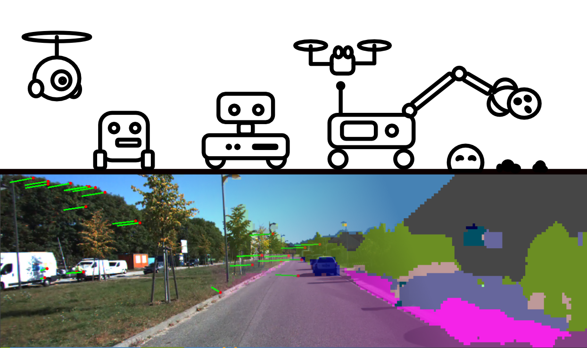

# Efficient Multi Task models for SLAM applications

This repository contains code for training, evaluating and exporting efficient multi taskmodels for edge devices.
They aim at solving multiple tasks simultaneously to be used within a SLAM pipeline:
- Keypoint Detection/Description
- Semantic Segmentation
- Visual Place Recognition (VPR)
- Monocular Depth Estimation (experimental)


Implemented are  fully convolutional models, transformer based models as well as a hybrid.

Supported export formats are:
- ONNX

Furthermore there is also support for light glue matching models.
## Structure
The repository is structured as follows:
  ```
.
├── src                     # Source code for the project
│   ├── data                # Data loading and processing implementations
│   │   ├── pittsburgh.py   # Pittsburgh dataset handling
│   │   ├── tokyo247.py     # Tokyo 24/7 dataset handling
│   │   ├── coco.py         # COCO dataset handling
│   │   └── dataset.py      # Simple dataset class
│   ├── evaluation          # Evaluation methods for each task
│   ├── kp2dtiny            # Model implementations (Standalone, portable)
│   │   ├── models          # Neural Network implementations
│   │   ├── modules         # Modules used within models
│   │   └── utils           # Utilities used in models
│   └── visual_odometry     # Visual odometry pipeline implementation
├── bash_scripts            # Shell scripts for setup and data acquisition
├── demo_data               # Data for demonstration purposes
├── lightglue               # Lightglue implementation from glue-factory 
├── utils                   # Various utilities
├── create_depth.py         # Create depth ground truths using MiDaS
├── create_segmentation.py  # Create segmentation ground truths using a pretrained model (not yet working)
├── demo.py                 # Demo script for visual odometry
├── eval_multitask.py       # Evaluation script for all tasks
├── export_onnx.py          # Export model to onnx format
├── plot_script.py          # Plots results from evaluation
├── quantize.py             # Implements quantization methods
├── train_multitask.py      # Training script for multitask pretraining (and segmentation finetuning)
├── train_visloc.py         # Training script for VPR task finetuning
├── vo_eval.py              # Alternative evaluation script for visual odometry
├── requirements.txt        # Requirements for the project
├── datasets_template.json  # Template to specify dataset paths
└── README.md               # Project documentation
  ```
## Note
- Results might be higher than reported in the report due to a prior bug which is now resolved. During segmentation evaluation ignore_index was not set before resulting in undefined pixels being counted.
# Setup
## Python environment
1. Create python environment (3.10/3.11 tested)
2. install requirements `pip3 install -r requirements.txt` (cuda 12.4, for cuda 11.8 use requirements_cu118.txt)
Or use uv:
1. Install [uv](https://docs.astral.sh/uv/getting-started/installation/)
2. run `uv sync`
## Datasets
1. setup datasets (see section datasets)
2. create `datasets.json` containing your dataset directories (use `datasets_template.json` as a template):  
  ```
{
    "hpatches_data_path": "..\\Datasets\\HPatches",
    "nyuv2_data_path": ..\\Datasets\\NYUv2_Labeled",
    "nyuv2_depth_data_path": "..\\Datasets\\NYUv2",
    "scene_parse_data_path": "..\\SceneParse150",
    "cityscapes_data_path": "..\\Datasets\\Cityscapes",
    "pittsburgh_data_path": "..\\Datasets\\pittsburgh",
    "coco_data_path": "..\\Coco",
    "kitti_path": "..\\kitti06",
    "kitti_gt_path": "06.txt",
    "kitti_video_path": "video_color.mp4"
}
  ```
  Note: you will not need all of these datasets. Mainly Coco/Pittsburgh/Cityscapes for training and Kitti/Hpatches for testing.
1. get pretrained models
2. (recommended) setup weights and biases for logging (wandb)
3. Check if multitask training works by running the following command:
  ```
  python .\train_multitask.py --config S  --device cpu
  ```
or using cuda:
  ```
  python .\train_multitask.py --config S  --device cuda
  ```
1. Run Demo script (check demo_data/readme.txt to get model weights and test data)
# Models
We implement a variety of models. The exact configurations can be found in the model class file.
## Weight Sharing Strategy
- Dedicated Decoders (DD or V2): Shared backbone for all tasks with dedicated decoder for each task
- Decoder Fusion (DF or V3): Shared backbone with tasks of similar complexity fused together in the decoder (segmentation + feature description and feature location + scores)

## Efficient Self Attention
To improve semantic segmentation performance we implement a self attention mechanism based on convolutions. This is used in the segmentation task head.

## Sizes
- Nano (N): 0.4M parameters
- Small (S): 0.9M parameters

## KeypointFormer
We experimented with adapting the SegFormer architecture to our multitask setting. While promising it seemed like the model would be too big and so this avenue has not been explored further. Consequently scripts might not work anymore with the model.

# Training
There are two stages of training
1. **Multitask**: Train the model on all tasks simultaneously ``train_multitask.py``
    - works for both scene_parse and cocostuff datasets (cocostuff is recommended)
2. **Finetune Segmentation**: Train the model only on the Segmentation Task ``train_multitask.py``
   - if deemed necessary freeze the backbone by using the flag: ``--freeze_backbone``
   - you can also decide to only train the segmentation head by using the flag: ``--only_segmentation``, however this is not recommended when using the fused decoder models.
   - currently we support Cityscapes for this.
3. **Finetune for MCU**: Finetune the model for MCU by using  ``train_multitask.py --to_mcu``
   - it is recommended to this after pretraining and before VPR finetuning
4. **Finetune VPR**: Train the model only on the Visual Place Recognition Task ``train_visloc.py``
   - make sure to freeze the backbone (``--freeze_backbone``) so that only the visloc task is trained
   - using the pittsburgh dataset is recommended for this task
   - this step should be done as the last step of training do not forget the ``--to_mcu`` flag in case you want to deploy the model on an MCU

## Creating Ground truths
To create ground truths for segmentation and depth estimation tasks we can use large pretrained models. A simple implementation can be found in ``create_depth.py`` and ``create_segmentation.py``.

This is required for datasets where there are no ground truths available for either depth or segmentation tasks.
# Evaluation
To evaluate the model use 'eval_multitask.py'. The script requires the model path with the matching model type and config.
Use flags to run evaluation on tasks: ``--vo --keypoints --visloc --segmentation``
Use the debug flag to get a visual output of the model's predictions.
``
python .\eval_multitask.py ---model_path ./trained_checkpoints/V2_S_A_CS.ckpt --debug --vo --keypoints --visloc --segmentation--device cpu --result_dir results_quantized  
``

# Export
We can export models to different formats. After training the model state dict is stored in a .ckpt file. Loading it requires using ``torch.load("FILE_PATH")["state_dict"]``.

## ONNX
To export the model to onnx format we can use the following script:
```
python .\export_onnx.py --weight_path .\checkpoints\tiny_S.ckpt --config S --im_h 120 --im_w 160  --model_type KP2Dtiny
```
- **model_type**: KP2Dtiny, KeypointNet, KeypointFormer
- **config**: S, S_A, N, N_A
- **im_h/im_w**: input image width and height (make sure it is divisible by 8 or 16 depending on how many max pooling layers a model has)


# Datasets:
- To get you started and reproduce the main results you will need at least the datasets cocostuff, HPatches and pittsburgh. For the additional semantic segmentation benchmarking we recommend also downloading the cityscapes dataset.
- Note: in case issues arise with the datasets, please refer to the respective dataset websites for more information.
## NYU Depth V2
- 1449 labeled images
- RGB/Depth/Segmentation/(Instances)
- 894 classes
- Note: you will have to extract the images from the dataset first.
- the non labeled dataset can be downloaded from huggingface automatically
- [NyuDepthV2](https://cs.nyu.edu/~silberman/datasets/nyu_depth_v2.html)
- [NyuDepthV2_labeled_torrent](https://academictorrents.com/details/47a9a46bb784b394e398228d4c85a8d61d01dfa8)


## Scene Parse 150
- 20000 labeled images
- RGB/Segmentation
- 150 classes
- [Huggingface](https://huggingface.co/datasets/zhoubolei/scene_parse_150)
## TOKYO 24/7
- [perspective images](https://www.dropbox.com/sh/0l04qchbc73kigr/AAAXPuB1J7aD77VJorB-OhTYa?dl=0)
- [Queries](http://www.ok.ctrl.titech.ac.jp/~torii/project/247/)

## Pittsburgh 250
- [link](https://data.ciirc.cvut.cz/public/projects/2015netVLAD/Pittsburgh250k/)

## Coco Stuff
```
# Get this repo
git clone https://github.com/nightrome/cocostuff.git
cd cocostuff

# Download everything
wget --directory-prefix=downloads http://images.cocodataset.org/zips/train2017.zip
wget --directory-prefix=downloads http://images.cocodataset.org/zips/val2017.zip
wget --directory-prefix=downloads http://calvin.inf.ed.ac.uk/wp-content/uploads/data/cocostuffdataset/stuffthingmaps_trainval2017.zip

# Unpack everything
mkdir -p dataset/images
mkdir -p dataset/annotations
unzip downloads/train2017.zip -d dataset/images/
unzip downloads/val2017.zip -d dataset/images/
unzip downloads/stuffthingmaps_trainval2017.zip -d dataset/annotations/

```

## HPatches

  ```
  wget http://icvl.ee.ic.ac.uk/vbalnt/hpatches/hpatches-sequences-release.tar.gz
  tar -xvf hpatches-sequences-release.tar.gz
  mv hpatches-sequences-release HPatches
  ```

## Kitti test sequence
You can find kitti test sequences in the [PySlam repository](https://github.com/luigifreda/pyslam/tree/master/data/videos)

## Kitti benchmark
get the kitty benchmark [link](https://www.cvlibs.net/datasets/kitti/eval_odometry.php)

## Cityscapes
get the cityscapes dataset [link](https://www.cityscapes-dataset.com/downloads/)
Use the python package cityscapesscripts:
  ```
  mkdir CityScapes
  csDownload gtFine_trainvaltest.zip
  csDownload leftImg8bit_trainvaltest.zip
  unzip gtFine_trainvaltest.zip
  unzip leftImg8bit_trainvaltest.zip
  rm gtFine_trainvaltest.zip
  rm leftImg8bit_trainvaltest.zip

  ```


## Pretrained Models
- Contact nanovs@thomasengineer.com for the weights
# Training Light Glue
Light glue is a neural network dedicated to matching keypoints.
It can be trained on custom feature point detectors such as this one.
To train thel light glue model:
1. Clone and install [glue-factory](https://github.com/cvg/glue-factory)
2. copy the directory "kp2dtiny" from here to gluefactory/models
3. copy the files from gluefactory to the gluefactory directory. They should merge with the existing files.
5. copy checkpoint files to data/kp2dtiny_checkpoints
6. run ```python -m gluefactory.train kp2dtiny --conf .\gluefactory\configs\kp2dtiny+lightglue_homography.yaml```

# Limitations
- The Aggregation layer can be an issue for ONNX.
  - NetVLAD: not supported
  - ConvAP/GeM: can be exported but might lack support on some platforms such as GAP9

# Sources
This repository uses code from:
- [pytorch-NetVlad](https://github.com/Nanne/pytorch-NetVlad)
- [NyuDepthV2](https://cs.nyu.edu/~silberman/datasets/nyu_depth_v2.html)
  - [NyuDepthV2_labeled_torrent](https://academictorrents.com/details/47a9a46bb784b394e398228d4c85a8d61d01dfa8)
- [Segformer-Pytorch](https://github.com/lucidrains/segformer-pytorch)